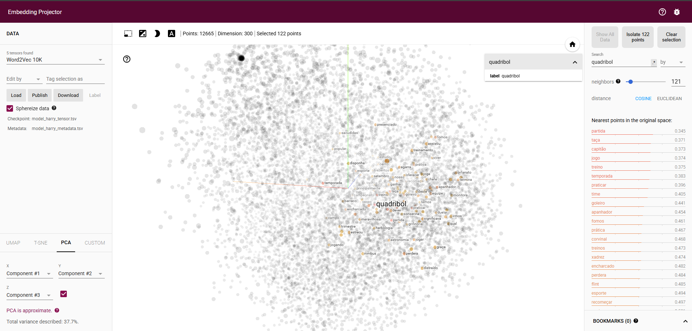

# TPC 9 - Treino de Modelos com Word2Vec

Este projeto consiste no treino de um modelo **Word2Vec** utilizando textos 
dos livros *Harry Potter e a Câmara Secreta* e *Harry Potter e a Pedra Filosofal*. 
O objetivo é explorar as relações semânticas entre palavras presentes nos textos, 
utilizando diferentes funções do modelo Word2Vec e visualizar os embeddings no **TensorFlow Embedding Projector**.

---

## Estrutura

- **`data/`**: Contém os textos dos livros utilizados para treinar o modelo.
  - `Harry_Potter_Camara_Secreta-br.txt`
  - `Harry_Potter_e_A_Pedra_Filosofal.txt`
- **`models/`**: Diretoria onde o modelo treinado e os arquivos para visualização são salvos.
  - `model_harry.txt`: Modelo Word2Vec salvo no formato de texto.
  - `model_harry_tensor.tsv`: Vetores das palavras.
  - `model_harry_metadata.tsv`: Rótulos das palavras.
- **`tpc.ipynb`**: Notebook Jupyter com o código para treinar o modelo e explorar as palavras.

---

## Processo

1. **Treino do Modelo Word2Vec**:
   - Os textos foram tokenizados e utilizados para treinar um modelo Word2Vec com as seguintes configurações:
     - Vetores de dimensão: `300`
     - Janela de contexto: `5`
     - Algoritmo: Skip-Gram (`sg=1`)
     - Número de épocas: `20`

2. **Exploração do Modelo**:
   - Foram realizadas análises semânticas utilizando funções como:
     - **`get_word`**: Para visualizar o vetor da palavra.
     - **`most_similar`**: Para encontrar palavras mais similares.
     - **`doesnt_match`**: Para identificar palavras que não combinam.
     - **`similarity`**: Para calcular a similaridade entre palavras.
     - **`distance`**: Para medir a distância semântica entre palavras.

3. **Visualização no TensorFlow Embedding Projector**:
   - O modelo foi convertido para o formato `.tsv` utilizando o comando:
     ```bash
     python -m gensim.scripts.word2vec2tensor -i models/model_harry.txt -o model_harry
     ```
   - Os arquivos gerados foram carregados no [TensorFlow Embedding Projector](https://projector.tensorflow.org) 
para explorar os embeddings de forma interativa.

---

## Visualização dos Embeddings

Abaixo está uma captura de tela da visualização dos embeddings no TensorFlow Embedding Projector. 
Nesta visualização, é possível observar as relações semânticas entre palavras como "quadribol", 
"jogo", "treino", "capitão", entre outras, que estão relacionadas ao contexto desportivo do quadribol.




### Scatter Plot
Além do TensorFlow Embedding Projector, foi gerado um scatter plot utilizando PCA (Principal Component Analysis) 
para reduzir os vetores de 300 dimensões para 2 dimensões. Este gráfico permite visualizar as relações 
entre palavras selecionadas diretamente no notebook, destacando proximidades semânticas entre palavras como 
"quadribol", "vassoura", "jogo", entre outras.

---